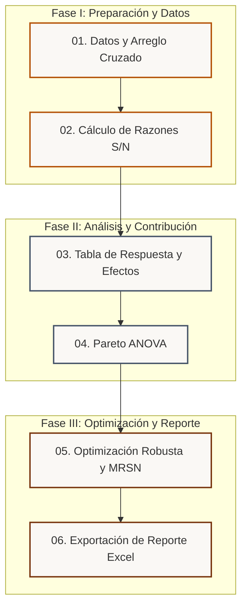

# 🍫 Modelo robusto - Tostado de Cacao Nacional

> **Diseño Robusto de Parámetros de Taguchi** aplicado al proceso de tostado térmico de Cacao Fino de Aroma (Nacional) para minimizar la variabilidad frente a factores de ruido ambiental e iniciales.

[](https://share.streamlit.io)
[](https://www.python.org/)
[](https://opensource.org/licenses/MIT)

---

## 🎯 Objetivos del Proyecto

Este aplicativo interactivo implementa de forma independiente el **Diseño de Experimentos de Taguchi** para optimizar las propiedades de calidad del tostado de cacao. El objetivo principal es identificar la combinación de factores de control (Temperatura y Tiempo) que maximice los compuestos bioactivos y la aceptación sensorial, garantizando al mismo tiempo la **insensibilidad (robustez)** frente a las variaciones incontrolables de la humedad del grano y del entorno.

> [!WARNING]
> **Nota de Transparencia Académica:** Los datos utilizados en este aplicativo son de naturaleza **sintética**, calibrados con base en un modelo físico-químico aproximado (`response_model.py`) para simular respuestas térmicas. El software está diseñado con fines educativos y de demostración metodológica.

---

## 🧭 Navegación Metodológica y Flujo de Trabajo

La interfaz de usuario implementa un **asistente interactivo paso a paso** (Wizard/Stepper) en el contenido principal que guía de manera lógica al analista a través de las tres fases fundamentales del Diseño Robusto de Taguchi:



---

## 📊 Parámetros Experimentales

### ⚙️ Factores de Control (Matriz Interna $L_9$)
Son las variables que el operador puede fijar y ajustar en el tostador de café/cacao:
* **Temperatura de Tostado ($A$):** Nivel 1 (120 °C) | Nivel 2 (140 °C) | Nivel 3 (160 °C)
* **Tiempo de Tostado ($B$):** Nivel 1 (10 min) | Nivel 2 (20 min) | Nivel 3 (30 min)

### 🌧️ Factores de Ruido (Matriz Externa $L_4$)
Variables difíciles de controlar en condiciones reales que inducen variabilidad:
* **Humedad Ambiental ($N_1$):** Baja (50% HR) | Alta (80% HR)
* **Humedad del Grano de Cacao ($N_2$):** Baja (5% humedad inicial) | Alta (8% humedad inicial)

### 🍫 Respuestas de Calidad y Criterios Señal/Ruido ($S/N$)
1. **Polifenoles Totales (mg GAE/g):** Criterio *Mayor es Mejor* (LB) $\rightarrow$ Maximizar antioxidantes.
2. **Actividad Antioxidante DPPH (% inhibición):** Criterio *Mayor es Mejor* (LB) $\rightarrow$ Preservar capacidad funcional.
3. **Índice de Pardeamiento (Color L\*a\*b\*):** Criterio *Nominal es Mejor* (NB, Valor Objetivo = $45.0$) $\rightarrow$ Evitar tostado insuficiente o quemado.
4. **Puntaje Sensorial (Escala Hedónica 1-9):** Criterio *Mayor es Mejor* (LB) $\rightarrow$ Peso incrementado a $1.5$ en análisis multirespuesta para priorizar el sabor.

---

## 🧮 Fundamentos Matemáticos

El motor estadístico (`taguchi_core.py`) realiza de forma nativa los siguientes cálculos:

### 1. Relación Señal/Ruido ($S/N$)
Mide la robustez frente al ruido ambiental. Se modelan tres criterios fundamentales:

* **Más Grande es Mejor (Larger-is-Better - LB):**
  $$S/N_{LB} = -10 \log_{10} \left( \frac{1}{n} \sum_{i=1}^{n} \frac{1}{y_i^2} \right)$$

* **Más Pequeño es Mejor (Smaller-is-Better - SB):**
  $$S/N_{SB} = -10 \log_{10} \left( \frac{1}{n} \sum_{i=1}^{n} y_i^2 \right)$$

* **Nominal es el Mejor (Nominal-is-Best - NB):**
  $$S/N_{NB} = 10 \log_{10} \left( \frac{\bar{y}^2}{s^2} \right)$$
  *Donde $\bar{y}$ es la media de las repeticiones, $s^2$ la varianza muestral, y $n$ el número de repeticiones (corridas externas).*

### 2. Pareto ANOVA (Análisis de Varianza Simplificado)
Calcula el impacto porcentual de la contribución directa de cada factor de control sobre la estabilidad del proceso:
$$\text{Suma de Cuadrados Total (SSt)} = \sum_{j=1}^{m} (SN_j - \overline{SN})^2$$
$$\text{Contribución (\%)} = \frac{SS_{\text{Factor}}}{SS_{\text{Total}}} \times 100$$

### 3. Índice Multirespuesta (MRSN)
Fusión de múltiples respuestas de calidad utilizando la ponderación de deseabilidad por pesos relativos ($w_k$):
$$\text{MRSN}_j = \sum_{k=1}^{R} w_k \cdot \left[ \frac{SN_{j,k} - SN_{\min,k}}{SN_{\max,k} - SN_{\min,k}} \right]$$

---

## 📂 Estructura del Repositorio

El proyecto se encuentra dividido modularmente bajo la siguiente estructura limpia:

```bash
taguchi_cacao/
├── app.py                         # Interfaz gráfica interactiva y Layout CSS
├── taguchi_core.py                # Núcleo analítico estadístico (cálculos S/N y ANOVA)
├── response_model.py              # Simulador de respuestas físicas del tostado de cacao
├── generate_data.py               # Script para generar y calibrar la matriz experimental cruzada
├── requirements.txt               # Dependencias del entorno de ejecución de Python
├── .streamlit/
│   └── config.toml                # Estilos del motor Streamlit
└── data/
    └── cacao_taguchi_sintetico.csv # Dataset calibrado con 36 corridas (9 control x 4 ruido)
```

---

## 🛠️ Instalación y Ejecución Local

### Prerrequisitos
* Python 3.8 o superior instalado en el sistema.

### Pasos de Configuración

1. **Clonar este repositorio** en tu entorno de trabajo local:
   ```bash
   git clone https://github.com/JavierChicaizaE/taguchi_cacao.git
   cd taguchi_cacao
   ```

2. **Crear y activar un entorno virtual**:
   * En **macOS / Linux**:
     ```bash
     python3 -m venv .venv
     source .venv/bin/activate
     ```
   * En **Windows (PowerShell)**:
     ```powershell
     python -m venv .venv
     .venv\Scripts\Activate.ps1
     ```

3. **Instalar los paquetes de dependencias**:
   ```bash
   pip install -r requirements.txt
   ```

4. **Generar el dataset de calibración experimental** (Matriz cruzada $L_9 \times L_4$):
   ```bash
   python generate_data.py
   ```

5. **Ejecutar el aplicativo local de Streamlit**:
   ```bash
   streamlit run app.py
   ```

La terminal mostrará un enlace automático. Abre la dirección `http://localhost:8501` en tu navegador.

---

## 👥 Autores del Proyecto (Equipo Académico)

Este aplicativo interactivo fue diseñado e implementado por:
* **Chicaiza Eduardo**
* **Guamanarca Didier**
* **Tamay Katherine**

---

## 🤖 Declaración de Uso de IA

De acuerdo con las directrices académicas, se declara el uso de herramientas de Inteligencia Artificial en las siguientes fases del desarrollo:

| Tarea Asistida | Modelo de IA Utilizado | Alcance de la Asistencia y Validación |
| :--- | :--- | :--- |
| **Estilización Visual Premium** | Gemini 3.5 Flash | Creación del sistema de temas visuales terrosos (Claro/Oscuro), paleta de colores terrosos libres de morado y tipografías en `app.py`. |
| **Arquitectura de Navegación** | Gemini 3.5 Flash | Desarrollo del stepper dinámico interactivo en el contenido principal, reemplazando la selección simple en barra lateral. |
| **Adaptabilidad y Tema Oscuro** | Gemini 3.5 Flash | Ajustes avanzados en CSS de dropdowns, portales, renderizado KaTeX y configuración de `theme=None` en gráficos Plotly. |
| **Estructuración Matemática** | Gemini 3.5 Flash | Diseño de fórmulas complejas en KaTeX y desarrollo del índice multirespuesta (MRSN). |